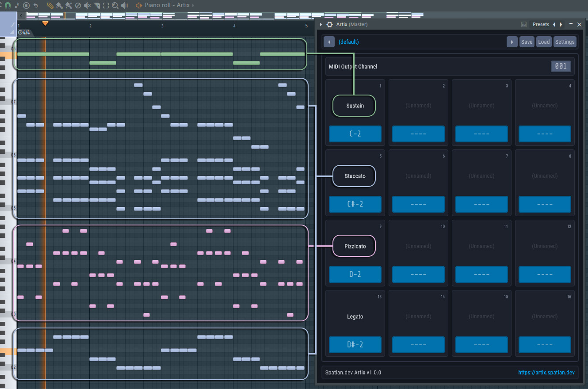
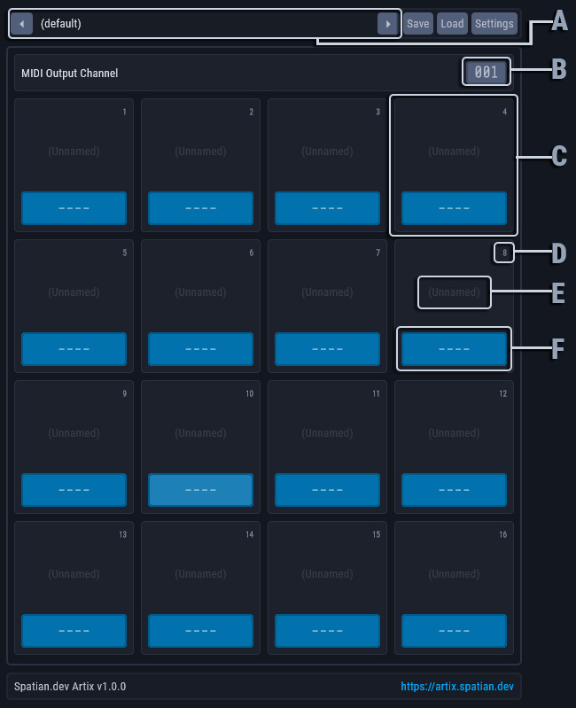
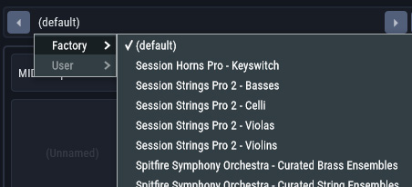
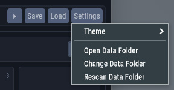

# Artix
A simple VST that maps MIDI channels to notes, to simplify your keyswitches and more.

## What is Artix?
[Artix](https://artix.spatian.dev) provides a way for music producers to map MIDI channels to MIDI notes.\
This allows sending notes on different MIDI channels to trigger a different articulations per MIDI channel.

- **[Does this work with my DAW](#does-this-work-with-my-daw)**
- **[How to use Artix](#how-to-use-artix)**
   - [Installation](#installation)
   - [User Interface](#user-interface)
   - [Usage](#usage)
- **[Platforms, Build, and Debug](#platforms-build-and-debug)**
   - [Supported platforms](#supported-platforms)
   - [Building](#building)
   - [Debugging](#debugging)
   - [Contributing](#contributing)
- **[Credits](#credits)**
   - [License](#license)

## Does this work with my DAW
The only prerequisite is that your DAW supports assigning different MIDI channels to individual notes on the same track. This is the main feature of this plugin.

Unfortunately, some DAWs like Ableton Live and Avid ProTools do not support this feature, and as such this plugin is of limited use in those DAWs.

This plugin is confirmed to work correctly on the following platforms:
- [Image-Line FL Studio](https://www.image-line.com/): Windows 10, Windows 11
- [Cockos Reaper](https://www.reaper.fm/): Windows 10, Windows 11

> **ℹ️** Have you built and tested this plugin on a platform / DAW missing form this list ? Please reach out!

## How to use Artix
### Installation
- Download and Install the latest [Microsoft Visual C++ Redistributable](https://aka.ms/vs/17/release/vc_redist.x64.exe)
- Compile or [Download the latest compiled binaries](https://github.com/spatian-dev/artix/releases/latest) for your platform.
- Place the binaries in the appropriate folder for your platform
    - For VST3, see [VST3 location for Windows](https://helpcenter.steinberg.de/hc/en-us/articles/115000177084-VST-plug-in-locations-on-Windows) or [VST3 location for macOS](https://helpcenter.steinberg.de/hc/en-us/articles/115000171310-VST-plug-in-locations-on-Mac-OS-X-and-macOS)
- Open your DAW and scan for new plugins. Artix should show up in your DAW's plugin list.

### User Interface
Here's a breakdown of the user interface:

**1. Toolbar**
- **(A)** Preset Selector\
The preset selector displays the currently selected preset. The text on the selector will change colors to indicate that unsaved changes have been made.\
A single click on the selector will open up the presets menu. This menu will show the included factory presets along with your own custom presets from the configured data folder. You can also change presets using the buttons on either side of the preset selector.\
\
Additionally, double clicking the preset selector allows you to edit the preset's name.

- **Load** and **Save** Buttons\
The load and save buttons, as the name implies, allow you to load and save presets from and to arbitrary files.

- **Settings** Button\
The settings menu allows you to access and change a handful of useful configuration parameters.
	- The **Theme** menu displays a list of available themes to choose from.
	- **Open Data Folder** opens your currently configured data folder in your system's file browser.
	- **Change Data Folder** allows you to set a new data folder.
	- **Rescan Data Folder** reloads all the available presets from the currently configured data folder.\

**2. Main area**
- **(B)** MIDI Output Channel Selector\
Click and drag up or down to change. If you drag farther the channel number will change faster. You can also use you mouse's scroll wheel when the cursor is on top of the selector to make changes.\
	This is the MIDI channel that all MIDI messages going through Artix will be rerouted through.

- **(C)** MIDI Channel Panel
	- **(D)** MIDI Channel Number Indicator\
    This indicates this MIDI channel's number.\
    Incoming MIDI note on / off messages for this channel will automatically be converted into the configured note (see **F** below).

    - **(E)** MIDI Channel Name\
    Double click to edit. This allows you to set a name for this MIDI channel. It is useful to name the channel after the articulation it triggers, for example.

    - **(F)** MIDI Note Selector\
    Click and drag up or down to change. If you drag farther notes will change faster. You can also use you mouse's scroll wheel when the cursor is on top of the selector to make changes.\
    This is the note that will be triggered when Artix receives MIDI note on / off messages on this channel. You would set this to the keyswitch you want to trigger, for example.\
    When no note is indicated, no extra notes are triggered but incoming MIDI messages will still be rerouted to the configured MIDI output channel (see **D** above).

### Usage
Using this plugin goes as follows:
- Add an instance of Artix to your project
- Add an instance of the plugin you want to control using Artix (the target).
- Configure your DAW so that MIDI going out of Artix is sent into the target plugin.

How one would achieve this differs by DAW.
- In FL Studio, you can [set the MIDI output port on the wrapper for Artix and the MIDI input port on the wrapper for the target plugin to the same port](https://www.image-line.com/fl-studio-learning/fl-studio-online-manual/html/plugins/wrapper.htm#:~:text=plugin%20was%20loaded.-,MIDI,other%20MIDI%20device%20will%20be%20able%20to%20share%20exclusive%20MIDI%20data.,-Send%20note%20release).
- In Reaper, you can add send on the Artix mixer channel, and set its target to the target plugin.

Tutorial videos will be coming soon to better illustrate this section. In the meantime, if you have a question, feel free to post in the [💬General category on Discussions](https://github.com/spatian-dev/artix/discussions/categories/general).

> **ℹ️** Want to help fill this section ? Please make a short video showing how to setup Artix in your DAW and reach out to me!

## Platforms, Build, and Debug
### Supported platforms
Currently, the only version being built is a Windows x64 VST3 in Visual Studio 2022. However, it should not be very difficult to build this for your platform.

> **ℹ️** Want to help maintain builds for platforms other than windows ? Please reach out!

### Building
This project is made with the awesome [JUCE Framework](https://github.com/juce-framework/JUCE). Please see [Getting Started with JUCE](https://docs.juce.com/master/tutorial_new_projucer_project.html).\
You will need to install a C++ toolchain (and likely and IDE) for your platform.

Once that is done, you can simply open the included [artix.jucer](./artix.jucer) file in Projucer, select or add an exporter, and open the project as shown in JUCE's getting started tutorial.

### Debugging
> **⚠️** The following instructions are for Visual Studio 2022.

To make debugging easy while developing:
- Set the project **Artix_VST3** as your startup project.
- Set the debugging command in your IDE to JUCE's included [AudioPluginHost](https://github.com/juce-framework/JUCE/tree/master/extras/AudioPluginHost).
- Set the debugging command arguments to the full path of [Debug.filtergraph](Debug.filtergraph).

If additionally you would like to have the [Address Sanitizer (ASan)](https://learn.microsoft.com/en-us/cpp/sanitizers/asan?view=msvc-170), then make sure to:
- Rebuild the AudioPluginHost with ASan enabled.
- Have ASan enabled in all projects in the solution. (*`Properties`* > *`C/C++`* > *`Enable Address Sanitizer`*).

Eventually, and before releasing, you might want to test / debug the plugin inside actual DAWs. To do so, replace **AudioPluginHost** in your startup project's debugging command with your DAW's executable. Then when your DAW starts up, add an instance of the plugin and you should be able to hit breakpoints etc.

### Contributing
> **⚠️** Before submitting a PR or an issue, make sure to use the search bar in the issues section to see if the problem is not already addressed or currently being addressed.

If you have an idea for an improvement, please send a post in the [💡Ideas category on Discussions](https://github.com/spatian-dev/artix/discussions/categories/ideas), or open an issue and select *Feature request*.

If you're encountering a problem related to the code or build process, please open an issue and select *Bug report*, then thoroughly fill the form.
If you want to contribute a fix for a bug, please open an issue and select *Bug report*, then thoroughly fill the form.

Please include a [minimal reproducible example](https://en.wikipedia.org/wiki/Minimal_reproducible_example) to avoid your issue being closed.

## Credits
- This package was inspired by [BRSO Articulate](https://www.syntheticorchestra.com/tools/articulate/). Shout out to them.
- [Saad Sidqui](https://github.com/saadsidqui)
- [All the contributors](https://github.com/spatian-dev/artix/graphs/contributors)

### License
Artix is free and open-source software released under the AGPL-3.0 license. See [LICENSE](LICENSE) for more information.
